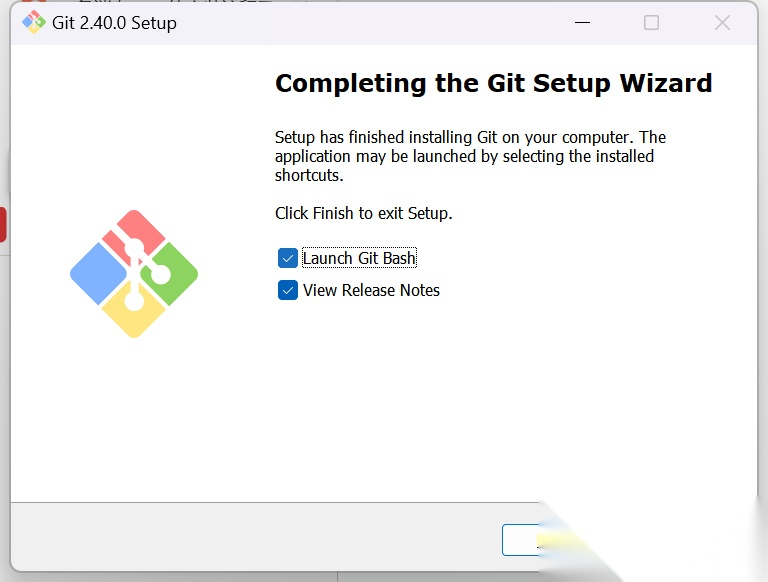
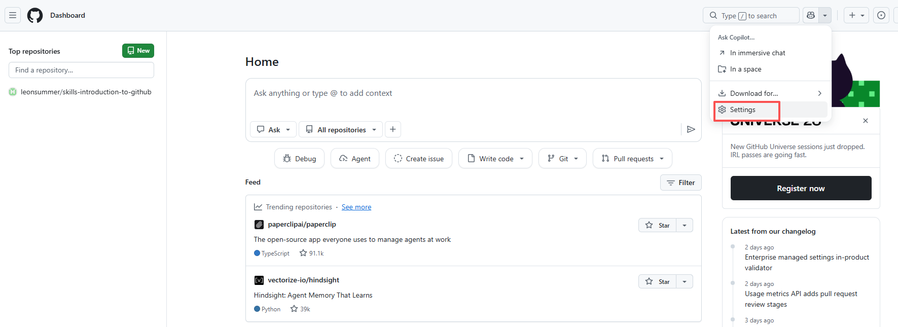
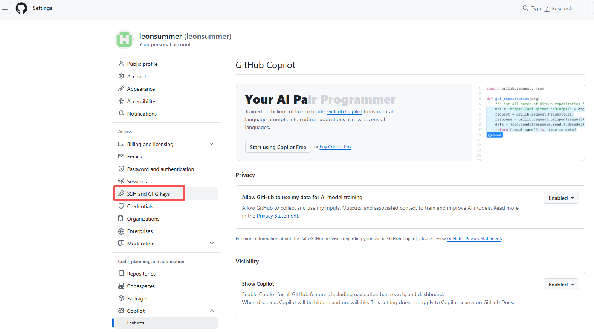
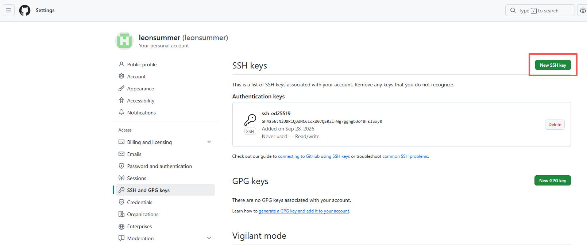
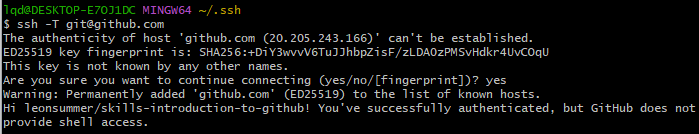
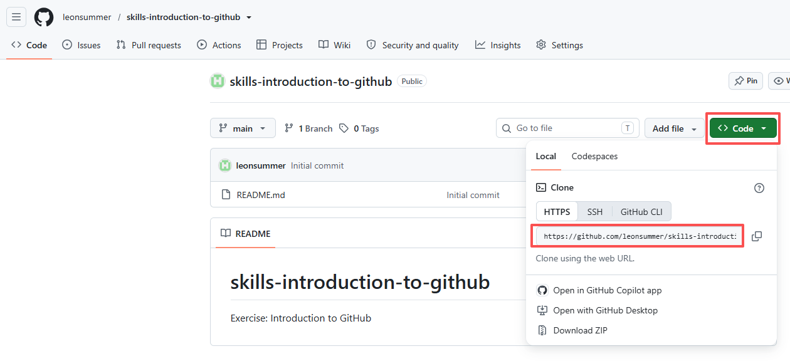
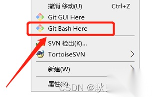
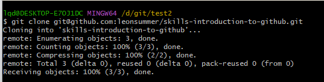
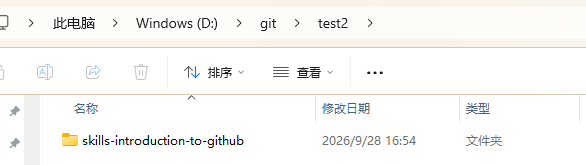

# github 入门指南
## 1.注册github账户
* 官网点击sign up，按照步骤注册即可

## 2.建立一个库
* 点击创建
  
* 按照下面说明完成创建
  

## 3.安装gitbash
* 官网下载对应系统的git，默认安装即可，进入launch
  
## 4.进行git和github的绑定
1.输入 ssh-keygen，三次回车，会在C:\Users\lqd\.ssh目录下生成id_ed25519.pub，文本编辑打开拷贝ssh-ed25519 开头的密钥;
2.然后进入github页面，按照下图点击顺序，添加拷贝密钥即可

3.回到Git bash上边，输入：ssh -T git@github.com，返回如下界面表示绑定成功

## 5.配置账户
* name可以随便配置，邮箱需要和GitHub上的一致
>git config user.name "仓库专用名字"
>git config user.email "仓库专用邮箱"
## 6.克隆仓库
1.在GitHub上获取对应仓库的地址

2.在本地对应目录下右键选择Git Bash Here

3.也可以使用 Git GUI Here进行界面操作
## 7.测试提交代码
1.使用bash窗口下的git命令 
>git add .

>git commit -m "注释说明"

>git push origin main  //推送到远端
